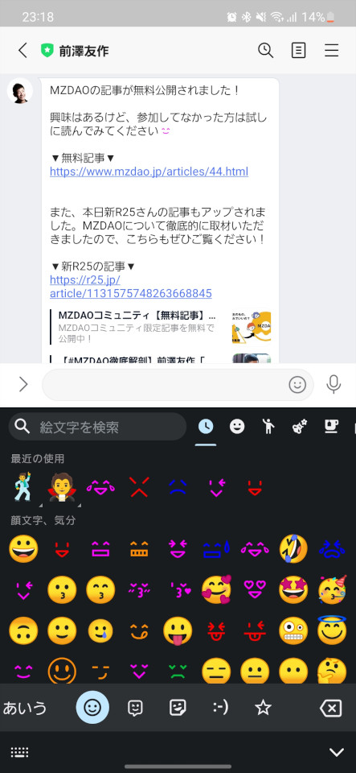
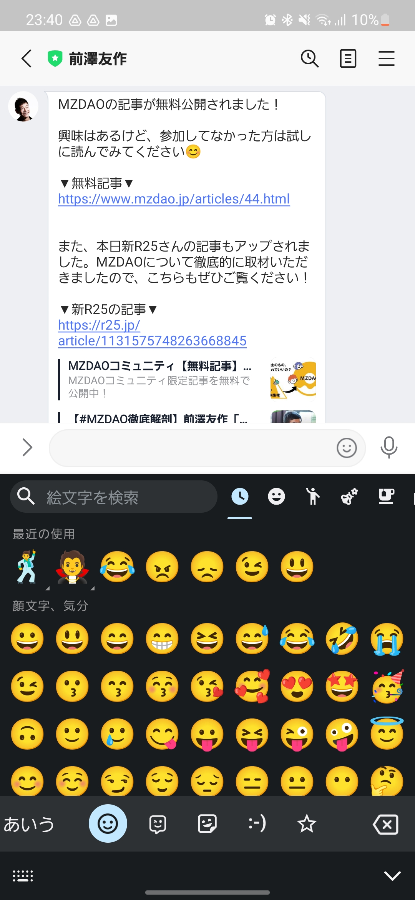

# noto-emojiをビルドする
docomoのダサい絵文字を抹消することが目的。
絵文字を変更するだけだったら、後述のzFont 3を使えば解決するが、アプリ内で選択できるフォントでは空白の間隔がおかしくなったり、リンクを意味する下線が下に行き過ぎたりと、表示がおかしくなってしまう。それを解決するためにnoto-emojiのソースレベルで調整してビルドするという作戦をとる。

## 動作確認端末

Galaxy S22

## Dockerインストール
起動しているPCがWindowsなら  
https://docs.docker.jp/docker-for-windows/install.html

起動しているPCがUbuntuなら  
https://docs.docker.com/engine/install/ubuntu/

## Docker実行
ビルド環境を用意するのが面倒なので、Dockerで用意した。
以下を実行する。devcontainerを使っている人はそのままGUI操作で開いてよい。

```bash
docker image build -t noto-emoji .
docker run --name noto-emoji-container -it noto-emoji /bin/bash
```

## ビルド準備
noto-emojiのリポジトリをCloneする。
今回は、Unicode 15.0の絵文字をビルドする。

```bash
git clone -b v2.038 https://github.com/googlefonts/noto-emoji.git
cd noto-emoji
```

絵文字以外のフォントやレイアウトを崩さないように以下のコマンドを実行する。

```bash
rm png/128/emoji_u002a* png/128/emoji_u0023* png/128/emoji_u003*
rm png/32/emoji_u002a* png/32/emoji_u0023* png/32/emoji_u003*
rm png/512/emoji_u002a* png/512/emoji_u0023* png/512/emoji_u003*
rm png/72/emoji_u002a* png/72/emoji_u0023* png/72/emoji_u003*
```
	
```bash
mv NotoColorEmoji.tmpl.ttx.tmpl NotoColorEmoji.tmpl.ttx.tmpl.bak
sed -e 's/".notdef" width="2550"/".notdef" width="680"/g' \
    -e 's/"nonmarkingreturn" width="2550"/"nonmarkingreturn" width="680"/g' \
    -e 's/"space" width="2550"/"space" width="680"/g' \
    -e 's/".notdef" height="2500"/".notdef" height="680"/g' \
    -e 's/"nonmarkingreturn" height="2500"/"nonmarkingreturn" height="680"/g' \
    -e 's/"space" height="2500"/"space" height="680"/g' \
    -e 's/underlinePosition value="-1244"/underlinePosition value="-300"/g' \
    NotoColorEmoji.tmpl.ttx.tmpl.bak > NotoColorEmoji.tmpl.ttx.tmpl
```

調整方法は以下のサイトを参考にした。

> Galaxyスマホの絵文字が気に食わないのでGoogleの絵文字に差し替える  
>  
> [](https://media.growth-and.com/galaxy%e3%82%b9%e3%83%9e%e3%83%9b%e3%81%ae%e7%b5%b5%e6%96%87%e5%ad%97%e3%81%8c%e6%b0%97%e3%81%ab%e9%a3%9f%e3%82%8f%e3%81%aa%e3%81%84%e3%81%ae%e3%81%a7google%e3%81%ae%e7%b5%b5%e6%96%87%e5%ad%97/)

そして、ソースコードを一部修正する。  
フォントの一部のファイルを削除したことで、ビルド前のチェック実装に引っかかってしまってビルドが通らない。チェックをすり抜けるように以下の実装を修正する。  
`check_emoji_sequences.py`の315行目あたり。

```bash
nano check_emoji_sequences.py
```

```diff
-  if not coverage_pass:
-    exit("Please fix the problems mentioned above or run: make BYPASS_SEQUENCE_CHECK='True'")
+  # if not coverage_pass:
+  #   exit("Please fix the problems mentioned above or run: make BYPASS_SEQUENCE_CHECK='True'")
```

## ビルド実行
ビルドは公式の[README](https://github.com/googlefonts/noto-emoji/blob/main/BUILD.md)に従って実行する。

```bash
python3 -m venv venv
source venv/bin/activate
pip install -r requirements.txt
rm -rf build/ && time make -j 48
```

結構かかるので、待つ。

ビルドが成功したら、以下のように出る。

```bash
Dropped outline ('glyf', 'CFF ') and related tables.
Found images for 3687 characters in 'build/compressed_pngs/emoji_u*.png'.
Embedding images for 3687 glyphs for this strike.
Strike ppem set to 109.
Output font 'NotoColorEmoji.ttf' generated.

CBDT table synthesized: 10249565 bytes.
CBLC table synthesized: 14864 bytes.

Output font 'NotoColorEmoji_WindowsCompatible.ttf' generated.
rm build/emoji/emoji_ufe82b.png

real    8m40.454s
user    131m19.178s
sys     0m36.879s
```

`NotoColorEmoji.ttf`が今回ほしいフォントファイルになる。  
別ターミナルで、以下を実行。

```bash
docker cp <コンテナID>:/noto-emoji/NotoColorEmoji.ttf NotoColorEmoji.ttf
```

Dockerからホスト側のPCにファイルを持ってくるときは以下のサイトを参考にする。

> Dockerでホストとコンテナ間でのファイルコピー  
>  
> [![img](https://qiita-user-contents.imgix.net/https%3A%2F%2Fcdn.qiita.com%2Fassets%2Fpublic%2Farticle-ogp-background-9f5428127621718a910c8b63951390ad.png?ixlib=rb-4.0.0&w=1200&mark64=aHR0cHM6Ly9xaWl0YS11c2VyLWNvbnRlbnRzLmltZ2l4Lm5ldC9-dGV4dD9peGxpYj1yYi00LjAuMCZ3PTkxNiZ0eHQ9RG9ja2VyJUUzJTgxJUE3JUUzJTgzJTlCJUUzJTgyJUI5JUUzJTgzJTg4JUUzJTgxJUE4JUUzJTgyJUIzJUUzJTgzJUIzJUUzJTgzJTg2JUUzJTgzJThBJUU5JTk2JTkzJUUzJTgxJUE3JUUzJTgxJUFFJUUzJTgzJTk1JUUzJTgyJUExJUUzJTgyJUE0JUUzJTgzJUFCJUUzJTgyJUIzJUUzJTgzJTk0JUUzJTgzJUJDJnR4dC1jb2xvcj0lMjMyMTIxMjEmdHh0LWZvbnQ9SGlyYWdpbm8lMjBTYW5zJTIwVzYmdHh0LXNpemU9NTYmdHh0LWNsaXA9ZWxsaXBzaXMmdHh0LWFsaWduPWxlZnQlMkN0b3Amcz1kYzVlNDIwNzY5Yjc1MmIzMTQwMzMzZTNmZTNlN2M0Mg&mark-x=142&mark-y=112&blend64=aHR0cHM6Ly9xaWl0YS11c2VyLWNvbnRlbnRzLmltZ2l4Lm5ldC9-dGV4dD9peGxpYj1yYi00LjAuMCZ3PTYxNiZ0eHQ9JTQwZ29sb2dvMTMmdHh0LWNvbG9yPSUyMzIxMjEyMSZ0eHQtZm9udD1IaXJhZ2lubyUyMFNhbnMlMjBXNiZ0eHQtc2l6ZT0zNiZ0eHQtYWxpZ249bGVmdCUyQ3RvcCZzPTViNzJkYjk3ODg2YTQ4N2IxMzdhN2ZmODU4ZGY3MmU2&blend-x=142&blend-y=491&blend-mode=normal&s=3797483712f1f1bca0f13f8b8568d336)https://qiita.com/gologo13/items/7e4e404af80377b48fd5)](https://qiita.com/gologo13/items/7e4e404af80377b48fd5)

## zFont 3での操作
ここからはAndroid側の操作となる。
別のブログのほうが詳しいので、ここを参考にする。

> ドコモ絵文字を完全抹殺。システムフォント変更アプリ「zFont 3」の使い方 
>  
> [](https://smhn.info/202209-docomo-emoji-z-font3)

## 出来上がり確認
### 処置前



### 処置後


